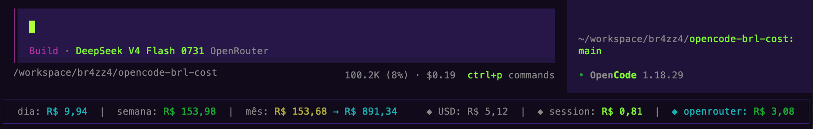

# opencode-brl-cost

OpenCode **TUI plugin** that pins cost tracking to the bottom bar, in Brazilian Reais (R$).

> **Note**: currently integrates only with **OpenRouter** for balance display. Other
> providers are tracked for cost (day/week/month) but the balance feature is OpenRouter-only.

### Provider balance integration

| Provider    | Balance display |
| ----------- | --------------- |
| OpenRouter  | ✅ Available    |
| OpenAI      | ⏳ Pending      |
| Anthropic   | ⏳ Pending      |
| Google      | ⏳ Pending      |
| Mistral     | ⏳ Pending      |
| xAI (Grok)  | ⏳ Pending      |

## Screenshot



## How it works

- Renders a fixed status bar via the `app_bottom` TUI slot.
- Bottom-left shows **aggregated spend across ALL opencode sessions** (every project, not just the current one) since the start of today, this week (Monday), and this month.
- The month figure is followed by a **month-end projection** (`mês: R$ 45,67 → R$ 52,30`): it averages the spend of the completed days so far (up to yesterday) and extrapolates to the rest of the month. Hidden on the 1st, on the last day, and when the month cost is zero.
- Bottom-right shows **the active session's total cost** (`session.cost`, USD).
- Costs come from each session's cumulative cost (`session.cost`, USD), attributed to the day it was **created**, converted with the **USD→BRL quote of that day** (see below).
- Sessions are enumerated via the SDK's global endpoint (`experimental.session.list`, with fallback to `session.list`) on load, and kept fresh through `session.*` events.
- Falls back to `R$ 0,00` when there's no data.
- Currency formatting uses `Intl.NumberFormat` with `pt-BR` (e.g. `R$ 1,23`).

### Daily USD→BRL quote

- Fetched once per day from **AwesomeAPI** (`GET https://economia.awesomeapi.com.br/json/last/USD-BRL`, field `bid`) — no auth, on plugin load, non-blocking.
- Cached in `<state>/brl-cost-rate.json` (`{ rate, date, timestamp }`). A cached quote from today (or yesterday) is reused instead of calling the API again.
- Each session is **stamped with the quote of the day it was created**, so day/week/month totals are computed with each session's own rate — not a single global rate.
- Shown bottom-right as `◆ USD: R$ 5,12` (muted when fresh, yellow/warning when the cache is from yesterday, `--` when 2+ days stale or never fetched — costs then fall back to R$ 5.00).

Your session's cost is shown bottom-right (`◆ session`), the OpenRouter balance is
shown on the right of the bar, and the **native bar below the prompt** still shows the
USD price (tokens + `$cost`). With a plugin option you can replace that native bar with
a cost-free prompt that keeps the model name:

```json
{
  "plugin": [["opencode-brl-cost", { "hideNativeCost": true }]]
}
```

When `hideNativeCost` is enabled, the plugin registers the `session_prompt` slot
(`mode: "replace"`) and renders the prompt with the model name only — no USD price,
no tokens. Drop the option (or set `false`) to restore the native bar.

### OpenRouter balance (pilot)

- Reads the OpenRouter key from `<state>/auth.json` (field `openrouter.key`) and calls
  `GET https://openrouter.ai/api/v1/credits` on load, +2s, and every ~60s.
- On the **home** screen (`home_bottom`) and on the session bar (`app_bottom`), shows the
  remaining credits in BRL (`total_credits - total_usage`, × the daily quote).
- No OpenRouter key found → nothing extra is rendered, plugin behaves as before.

## Install

Add the plugin to `tui.json`:

```json
{
  "plugin": ["opencode-brl-cost"]
}
```

Then **restart OpenCode**. The bottom bar appears at the bottom.

> Pin a version for stability: `"opencode-brl-cost@0.1.2"`.

## Why this shape

Per the `qwert:opencode-plugin` skill, OpenCode plugins must ship a **built `.js`** via npm with an
`exports["./tui"]` entrypoint. The runtime does **not** transpile `.tsx`/`.ts` from `node_modules` — it
fails silently. So this package publishes `dist/index.js` (esbuild output), never raw `.tsx`.

## Local development

```bash
npm install
npm run build      # → dist/index.js
npm run typecheck
```

To test a local checkout without publishing, point `tui.json` at the built file:

```json
{
  "plugin": ["file:///absolute/path/to/opencode-brl-cost/dist/index.js"]
}
```

## Publish

```bash
npm version patch
npm publish
```

## Roadmap

- Per-day rate tracking inside a single long session (sessions use the quote of their creation day)
- Session cost delta per last response
- Token counters (input/output)
- Balance for providers other than OpenRouter (pilot only)

## Contributing

Contributions are welcome! Feel free to open issues, suggest features, or submit
pull requests. Keep commits atomic and follow the existing code style.

## License

AGPL-3.0 · Copyright (C) 2025 oporpino <dev@porpi.no>

